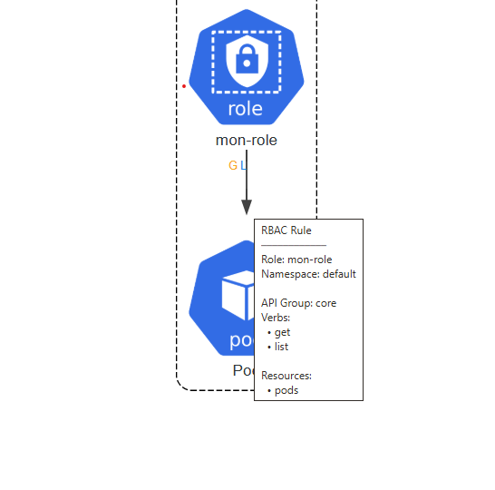

# Suivi

## 1. État de l'art des outils RBAC Kubernetes

### 1.1 RBAC Tool

**Installation**
```bash
git clone https://github.com/alcideio/rbac-tool.git
```

**Fonctionnalités**
- Visualisation des politiques RBAC sous forme de graphe (`viz`) 
- Analyse des permissions trop larges ou risquées (`analysis`)
- Recherche des autorisations (`who-can`)
- Génération automatique de rôles

**Points forts**
- Outil très complet avec de nombreuses fonctionnalités
- Génération de graphe visuel en HTML ou PNG

**Limites**
- Écrit en Go (pas en Python)
- Interface CLI uniquement, peu accessible
- Graphe basique (format dot/graphviz)

**Exemples d'utilisation**
```bash
# Générer un graphe au format dot
./bin/rbac-tool viz --outformat dot

# Vérifier qui peut récupérer les pods
./bin/rbac-tool who-can get pods
```

**Génération d'image PNG**
```bash
brew install graphviz
# Puis convertir le fichier .dot en PNG
dot -Tpng rbac.dot > rbac.png
open rbac.png
```


### 1.2 RBAC View

**Installation**
```bash
git clone https://github.com/jasonrichardsmith/rbac-view.git
```

**Fonctionnalités**
- Visualisation interactive des permissions RBAC dans le navigateur
- Deux modes : HTML (interface web) ou JSON

**Points forts**
- Interface web claire et agréable

**Limites**
- Projet abandonné (plus maintenu activement)
- Installation complexe (Go + npm)
- Pas de génération d'image, uniquement web live
- Non compatible avec Mac Apple Silicon (ARM)

**Tentative d'installation avec kubectl krew**
```bash
brew install krew
kubectl krew install rbac-view
# → Erreur : non compatible avec Mac Apple Silicon
```


### 1.3 Krane

**Fonctionnalités**
- Dashboard web complet avec vue graphe et arborescence
- Détection des permissions dangereuses
- Alertes Slack
- Peut tourner directement dans un cluster Kubernetes
- Base de données graphe (RedisGraph) pour requêter efficacement

**Points forts**
- Outil le plus complet des trois

**Limites**
- Installation très complexe (Docker, RedisGraph, Ruby...)
- Écrit en Ruby (pas en Python)
- Trop lourd pour une simple visualisation RBAC
- Difficile à faire tourner sur Mac Apple Silicon

**Tentative d'utilisation**
```bash
cd krane
docker-compose up -d
docker-compose ps

# Entrer dans le conteneur
docker-compose exec -e KUBECONFIG=/root/.kube/config krane bash

# Lancer un rapport
krane report -k minikube
# → Non fonctionnel (problèmes de certificats sur Mac Apple Silicon)
```


### 1.4 Récapitulatif des trois outils

| Outil | Langage | Visualisation | Analyse sécu | Facilité |
|-------|---------|---------------|--------------|----------|
| RBAC Tool | Go | Graphe basique | oui | Moyenne |
| RBAC View | Go | Interface web | non | Difficile (abandonné) |
| Krane | Ruby | Dashboard complet | oui | Très complexe |

**Conclusion** : Aucun de ces outils n'est léger, écrit en Python et intégré à un outil d'architecture Kubernetes existant.

---

## 2. Analyse interne : KubeDiagrams

**Dépôt** : https://github.com/philippemerle/KubeDiagrams

KubeDiagrams est un outil Python qui génère des diagrammes d'architecture Kubernetes à partir de fichiers YAML. Il supporte déjà les objets RBAC grâce aux icônes de la bibliothèque `diagrams` de mingrammer.

### 2.1 Ce qui existe déjà dans KubeDiagrams

**Icônes disponibles**
```python
diagrams.k8s.rbac.CRole   # ClusterRole
diagrams.k8s.rbac.CRB     # ClusterRoleBinding
diagrams.k8s.rbac.Role    # Role
diagrams.k8s.rbac.RB      # RoleBinding
diagrams.k8s.rbac.SA      # ServiceAccount
diagrams.k8s.rbac.User    # User
diagrams.k8s.rbac.Group   # Group
```

**Fonctions existantes dans `kube-diagrams`**
```python
add_subjects()
# crée les flèches entre les ServiceAccounts/Users/Groups et les RoleBindings

add_role()
# crée la flèche entre un RoleBinding et son Role

add_rules_resource_names()
# crée des flèches vers des ressources nommées explicitement dans les rules
#   (uniquement quand resourceNames est défini)
```

**Ce que ça donne visuellement**
```
[ServiceAccount] ──→ [RoleBinding] ──→ [Role]
```

### 2.2 Limites identifiées

1. **Verbes non affichés** : les règles (get, list, create, delete...) ne sont pas visibles sur les flèches. On ne sait pas ce qu'un Role peut faire concrètement.

2. **Ressources cibles absentes** : `add_rules_resource_names()` gère uniquement les ressources nommées explicitement (`resourceNames`), mais pas le cas général où un Role donne accès à tous les pods ou tous les secrets.

**Ce qui manque : le cas général non géré**
```yaml
rules:
- resources: ["pods", "secrets"]  # cas pas géré
  verbs: ["get", "list"]
```

### 2.3 

Créer une fonction `add_rules()` dans `kube-diagrams` qui :
- Lit toutes les `rules` d'un Role ou ClusterRole
- Crée des flèches vers les ressources cibles (Pods, Secrets, ConfigMaps...)
- Affiche les verbes sur les flèches (get, list, create...)

**Rendu**
```
[ServiceAccount] ──→ [RoleBinding] ──→ [Role] ──get, list──→ [pods]
                                              ──*──────────→ [secrets]
                                              ──create────→ [configmaps]
```

---

## 3. RBAC Kubernetes

### 3.1 Les verbes possibles

| Verbe | Ce que ça fait |
|---|---|
| `get` | Lire un objet précis |
| `list` | Lister tous les objets |
| `watch` | Observer les changements en temps réel |
| `create` | Créer un objet |
| `update` | Modifier un objet |
| `patch` | Modifier partiellement |
| `delete` | Supprimer un objet |
| `deletecollection` | Supprimer plusieurs objets |
| `*` | Tout faire |

### 3.2 Les objets RBAC 

**Role**
```yaml
kind: Role                                    # badge de permissions
apiVersion: rbac.authorization.k8s.io/v1     # version de l'API RBAC
metadata:                                     # informations d'identité
  name: pod-reader                            # nom du badge
  namespace: default                          # dans quel espace il s'applique
rules:                                        # liste des règles du badge
  - apiGroups: [""]                           # "" = groupe de base Kubernetes
    resources: ["pods"]                       # règle 1 : sur les pods
    verbs: ["get", "list"]                    # on peut juste lire, pas modifier ni supprimer
  - apiGroups: [""]
    resources: ["secrets"]                    # règle 2 : sur les secrets (mots de passe)
    verbs: ["*"]                              # on peut tout faire (dangereux !)
  - apiGroups: [""]
    resources: ["configmaps"]                 # règle 3 : sur les configs
    verbs: ["create", "update"]               # on peut créer et modifier, mais pas supprimer
```

**ClusterRole**
```yaml
kind: ClusterRole                             # pareil qu'un Role mais pour tout le cluster
apiVersion: rbac.authorization.k8s.io/v1
metadata:
  name: cluster-reader                        # pas de namespace car c'est global
rules:
  - apiGroups: [""]
    resources: ["nodes"]                      # règle 1 : sur les serveurs physiques
    verbs: ["get", "list"]                    # lecture seule
  - apiGroups: ["apps"]                       # "apps" = groupe pour les déploiements
    resources: ["pods"]                       # règle 2 : sur les applications
    verbs: ["*"]                              # droits complets sur tous les pods du cluster
```

**RoleBinding**
```yaml
kind: RoleBinding                             # lien entre des utilisateurs et un badge
apiVersion: rbac.authorization.k8s.io/v1
metadata:
  name: mon-binding
  namespace: default                          # dans quel espace s'applique le binding
subjects:                                     # qui reçoit le badge (peut être plusieurs)
  - kind: ServiceAccount                      # type : compte applicatif
    name: asma                                # asma reçoit le badge
    namespace: default
  - kind: User                                # type : utilisateur humain
    name: aya                                 # aya reçoit aussi le badge
    apiGroup: rbac.authorization.k8s.io
roleRef:                                      # quel badge on leur donne
  kind: Role                                  # c'est un Role (pas un ClusterRole)
  name: pod-reader                            # le badge s'appelle pod-reader
  apiGroup: rbac.authorization.k8s.io
```

**ClusterRoleBinding**
```yaml
kind: ClusterRoleBinding                      # pareil mais à l'échelle du cluster entier
apiVersion: rbac.authorization.k8s.io/v1
metadata:
  name: mon-cluster-binding                   # pas de namespace car c'est global
subjects:
  - kind: Group                               # type : groupe d'utilisateurs
    name: admins                              # tous les admins reçoivent le badge
    apiGroup: rbac.authorization.k8s.io
roleRef:
  kind: ClusterRole                           # c'est un ClusterRole cette fois
  name: cluster-reader                        # le badge cluster s'appelle cluster-reader
  apiGroup: rbac.authorization.k8s.io
```

écrit de façon simplifiée sinon mettre  - apiGroups: ["apps"]  # "apps" = groupe pour les déploiements ou apiGroups: [""] 

### 3.3 Récap visuel complet

```
[User: asma]  [User: aya]
       ↘           ↙
    [RoleBinding: mon-binding]
               ↓
          [Role: mon-role]
          ↙          ↓            ↘
  [pods]         [secrets]    [configmaps]
  get, list          *         create, update
```

---

## 4. Notes complémentaires

(exemple dans issues/issue#2)
### Le fichier semiotics.yaml

fichier de démonstration de KubeDiagrams qui montre un exemple de chaque type de ressource Kubernetes supportée. RBAC  déjà présent mais les flèches entre les Roles et les ressources cibles sont absentes : à ajouter.

---

## 5. À faire

1. Tester KubeDiagrams sur `semiotics.yaml` pour voir le rendu actuel
2. Comprendre en détail comment `add_rules_resource_names()` fonctionne
3. Implémenter `add_rules()` dans `kube-diagrams`
4. Ajouter l'appel à `add_rules()` dans `kube-diagrams.yaml` (comment chaque ressource Kubernetes doit être visualisée) pour Role et ClusterRole
5. Tester sur des fichiers YAML RBAC réels récupérés sur GitHub


**Liens**
- https://github.com/philippemerle/KubeDiagrams
- https://kubediagrams.lille.inria.fr
- https://kubernetes.io/docs/reference/access-authn-authz/rbac/


add_rules_resource_name() : crée des flèches entre un Role et des ressources nommées spécifiquement dans les rules (gère les resourceNames)


Représentation graphique :

[ServiceAccount: asma] ──┐
[User: aya]            ──┼──→ [RoleBinding: mon-binding] ──→ [Role: mon-role] ──get, list──→ [Pod]
[Group: admins]        ──┘                                                    ──*──────────→ [Secret]
                                                                              ──create────→ [ConfigMap]


qst : 
Que fait-on si la ressource cible n'existe pas dans le YAML ?
Comment afficher * sur les flèches ?
Que fait-on si resources: ["*"] ?


institute.sfeir : RBAC fonctionne en deux étapes : (1) créez un Role qui liste les permissions, (2) créez un RoleBinding qui attribue ce Role à un utilisateur. Principe fondamental : accordez toujours le minimum de privilèges nécessaires.

ici Role ne liste pas les permissions
RoleBinding ok


Fichiers intéressants pour nous : 
dans rbac-tool :

- cmd/visualize_cmd.go : définit la commande viz et ses options (modèle pour l'interface utilisateur)
Comment définir des options en ligne de commande (--show-rules, --exclude-namespaces).
Comment l'outil guide l'utilisateur (aide, exemples).
C'est un modèle à suivre pour créer la nouvelle commande `kubediagrams rbac`.

- pkg/rbac/subject_permissions.go : Utile pour comprendre comment les permissions sont liées aux sujets, mais sa logique interne est spécifique à RBAC Tool.
fichier est utile pour comprendre comment RBAC Tool modélise les permissions en mémoire (SubjectPermissionsList, PolicyRule, etc.).donne des idées pour structurer les données extraits des YAML dans code Python.

Version simplifiée en Python (pour comprendre)
class Sujet:
    def __init__(self, nom, namespace, type="ServiceAccount"):
        self.nom = nom
        self.namespace = namespace
        self.type = type
        self.permissions = []  # liste de (ressource, verbes)

class Regle:
    def __init__(self, ressource, verbes, api_group="core"):
        self.ressource = ressource
        self.verbes = verbes  # ["get", "list", "watch"]
        self.api_group = api_group


- pkg/visualize/rbacviz.go. : génération de diagrammes de RBAC Tool (contient la logique de création des nœuds et des arêtes)
Il contient la fonction renderGraph() qui:
Itère sur les RoleBindings.
Crée les sous-graphes (Subgraph) pour les namespaces.
Crée les nœuds pour les Sujets, les Bindings et les Rôles.
Et surtout, il contient la logique pour afficher les règles (newFormattedRulesNode).
À retenir: comment est construit le graphe à partir des données RBAC. Source d'inspiration pour la structure de notre code.

equivalent en Python : 

def render_rbac_graph(perms, show_rules=True):
    g = Graph()
    
    for binding in perms.role_bindings:
        ns = binding["namespace"]
        
        # Créer le nœud Binding
        binding_node = create_binding_node(g, binding)
        
        # Créer le nœud Role
        role_node = create_role_node(g, binding["roleRef"])
        
        # Arête Binding → Role
        g.edge(binding_node, role_node, label="refers to")

        ## déjà géré au dessus 
        
        # Pour chaque Sujet
        for subject in binding["subjects"]:
            subject_node = create_subject_node(g, subject)
            g.edge(subject_node, binding_node, label="bound to")
        
        # Si on affiche les règles
        if show_rules:
            for rule in role["rules"]:
                for resource in rule["resources"]:
                    resource_node = create_resource_node(g, resource)
                    verbs = ",".join(rule["verbs"])
                    g.edge(role_node, resource_node, label=verbs)
    
    return g


Attribution de rôle : un utilisateur doit se voir attribuer un ou plusieurs rôles actifs pour pouvoir exercer des permissions ou des privilèges.

Autorisation de rôle : l’utilisateur doit être autorisé à assumer le ou les rôles qui lui ont été attribués.

Autorisation de permissions : les permissions ou privilèges ne sont accordés qu’aux utilisateurs autorisés par l'attribution de leurs rôles.


class EdgesContext
add_role() : crée la flèche RoleBinding → Role
add_subjects() : crée les flèches Sujet → RoleBinding
add_rules_resource_names() : gère les cas particuliers de resourceNames


RBAC, Role, ClusterRole, RoleBinding, ServiceAccount
Verbes: get, list, watch, create, update, delete
Ressources: Pod, Secret, ConfigMap, Service, Deployment
Namespace, Label, KubeDiagrams, DOT, Diagramme
Flèches sémantiques, visualisation des permissions
###### add_rules_resource_names() — cas très spécifique
Elle gère uniquement quand on nomme une ressource précise :

rules:
- apiGroups: [""]
  resources: ["pods"]
  resourceNames: ["mon-pod-precis"]  # un pod précis
  verbs: ["get"]


crée une flèche vers le pod qui s'appelle exactement "mon-pod-precis"
- ce pod doit exister dans le fichier YAML
- les verbes ne sont pas affichés sur la flèche


###### add_rules() — cas général

Elle gère quand on donne accès à tous les objets d'un type :
rules:
- apiGroups: [""]
  resources: ["pods"]  # tous les pods
  verbs: ["get", "list"]

- crée une flèche vers tous les pods qui existent dans le fichier YAML
- les verbes sont affichés sur la flèche (get, list)


### Exemple à tester quand on aura codé add_rules

**Le pod précis qui existe dans le fichier**
```yaml
apiVersion: v1
kind: Pod
metadata:
  name: mon-pod-precis        # ← le pod nommé explicitement
  namespace: default
```

---

**Le ServiceAccount**
```yaml
apiVersion: v1
kind: ServiceAccount
metadata:
  name: asma
  namespace: default
```

---

**Le Role qui donne accès UNIQUEMENT au pod "mon-pod-precis"**
```yaml
kind: Role
apiVersion: rbac.authorization.k8s.io/v1
metadata:
  name: pod-reader
  namespace: default
rules:
- apiGroups: [""]
  resources: ["pods"]
  resourceNames: ["mon-pod-precis"]  # add_rules_resource_names() gère ça (sans ça c'est tous les pods)
  verbs: ["get"]
```
---

**Le RoleBinding**
```yaml
kind: RoleBinding
apiVersion: rbac.authorization.k8s.io/v1
metadata:
  name: asma-binding
  namespace: default
subjects:
- kind: ServiceAccount
  name: asma
  namespace: default
roleRef:
  kind: Role
  name: pod-reader
  apiGroup: rbac.authorization.k8s.io
```

[Role: pod-reader] ──get, list──→ [Pod: pod-1]
                   ──get, list──→ [Pod: pod-2]
                   ──get, list──→ [Pod: pod-3]

(trop chargé visuellement ?)


cas particuliers :

OK - resources : ["*"] # tous les types de ressources -> ignoré 

OK - verbs : ["*"] # tous les droits -> on garde 

OK - resources ["pods", "secrets", "configmaps"] # plusieurs resources dans une règle -> une flèche par ressource
    - apiGroups : ["", "apps"] # plusieurs apiGroups (comment combiner apiGroup et resource pour trouver le bon noeud)
-> (resource + apiGroups fonctionnent ensemble )

OK - resources ["pods/log"] # sous-resources avec "/" -> ignorer comme dans add_rules_resource_names() 

- nonResourceURLs: ["/healthz", "/metrics"] # pas une ressource Kubernetes classique, que faire, ignorer  ?
(URLs spéciales de l'API Kubernetes qui ne correspondent pas à des objets).  -> à voir plus tard 

OK - resources: ["pods"]
resourceNames: ["mon-pod"] # resourceNames combiné avec resources -> déjà géré par add_rules_resource_names(), ignorer dans add_rules() 

OK - resources: ["pods"]   # mais pas de Pod dans le fichier YAML -> déjà géré par add_edge_to()

OK - apiGroups: [""]   # groupe de base  -> déjà géré, "" devient "v1"

OK  - rules:
    - resources: ["pods"]
      verbs: ["get"]
    - resources: ["secrets"]
      verbs: ["*"]
      créer une flèche par règle -> illisible -> création de labels avec initial (+ compacte et lisible)


Résumé à ajouter :
- add_rules pour créer des flèches entre un Role et les ressources ciblées par ses rules.
- L'affichage des verbes comme étiquettes sur ces flèches.
- Une option (en ligne de commande) pour activer/désactiver l'affichage des verbes, par exemple --show-verbs.


### Commande de test 
```
python3 bin/kube-diagrams test.yaml -o test_output.png
```

add_rules() doit :
- lire les rules du Role
- Pour chaque ressource dans les rules (pods, secrets...)
- Chercher si cette ressource existe dans le fichier YAML
- Si oui : créer la flèche avec les verbes dessus
- Si non : on passe

---

Représentation graphique : flèches avec label de couleurs + première lettre du verbe de permission 

- faire une fonction pour générer le label à partir du verbe 

on s'aide du code qui génère les labels pour rbac-view (frontend/src/components/Actions.vue)

Dans Graphviz (le moteur de KubeDiagrams), on ne peut pas faire de vrais badges HTML/CSS. Mais on peut utiliser du HTML inline.

🟢 Vert = lecture
🔵 Bleu = liste
🟣 Violet = surveillance
🟠 Orange = modification/création
🔴 Rouge = suppression
⚫ Noir = tous droits

ou 

une couleur différente par label - repris de rbac-view (utilisé pour l'instant, à valider): 

🟡 GET
🔵 LIST
🟤 WATCH
🟢 CREATE
🩷 UPDATE 
🔴 DELETE
🩶 PATCH
⚫ DELETECOLLECTION
🟠  *       


-> modification de generate_label car graphiviz supporte pas le html donc affichage des lettres majusucules colorées pour les verbes 
add_rules ok mais sur un gros diagramme devient vite illisible avec beaucoup de flèches


- trouver une solution pour la lisibilité des permissions


### Cas particuliers / questions à discuter

1. 
OK - `resources: ["*"]`  
→ actuellement ignoré avec :

```python
if resource == '*':
    continue
```

idee possible :
- creer une fleche vers toutes les ressources trouvees dans le yaml 


2. OK - resources: ["pods/log"]

→ actuellement ignoré avec :
```python
if '/' in resource:
    continue
```
idee possible: 
extraire uniquement la ressource principale avant le /

3.- Problème d’affichage RBAC sur grands diagrammes  
  Quand beaucoup de règles RBAC sont affichées directement sur les flèches, le diagramme devient illisible.  

  Idée envisagée :  
  passer en SVG interactif et afficher les permissions uniquement au survol de la souris (tooltip).  



- changement pour add_rules : 
  visualisation des permissions RBAC via un nœud intermédiaire

  Pour chaque règle d'un Role ou ClusterRole, un nœud rect intermédiaire est inséré entre le Role et la ressource cible pour afficher les verbes autorisés sous forme de lettres colorées (G, L, C, U, D, P, DC, ★).

  Par exemple pour test.yaml on a :
    [Role] → [G L] → [Pod]


-> taille des rect et initiales à ajuster 


- tests :
  - % python3 bin/kube-diagrams test.yaml -o test_output.png
  - % python3 bin/kube-diagrams examples/kube-prometheus-stack/kube-prometheus-stack-corrected.yaml -o test_output2.png
  - % python3 bin/kube-diagrams examples/argo/argo-cd-manifests-install-corrected.yaml -o test_output3.png
  - % python3 bin/kube-diagrams examples/helm-charts/cert-manager.yaml -o test_output4.png
  


- ajouter un titre "permissions" au noeud 


- Ajustement des couleurs du noeud permissions pour une meilleure cohérence visuelle (code couleur récupéré des icones)


- Ajout d’une petite légende pour expliquer les lettres utilisées pour les permissions RBAC (G, L, W, C...).
La légende est créée avec un tableau HTML Graphviz (label) directement attaché au graphe principal.
Option ajoutée :
`--show-rbac-legend`

- tests :
  - % python3 bin/kube-diagrams test.yaml -o test_output.png --show-rbac-legend
  - % python3 bin/kube-diagrams examples/kube-prometheus-stack/kube-prometheus-stack-corrected.yaml -o test_output2.png --show-rbac-legend
  - % python3 bin/kube-diagrams examples/argo/argo-cd-manifests-install-corrected.yaml -o test_output3.png --show-rbac-legend
  - % python3 bin/kube-diagrams examples/helm-charts/cert-manager.yaml -o test_output4.png --show-rbac-legend


- Ajouter une distance min entre les flèches pour une meilleure lisibilité ?
- Régler le placement du noeud permission à l'intérieur du namesspace ?


12/05 : 

OK - permissions qui vont vers aucune ressource (et parfois aucun rôle)  -> le problème vient du fait qu’on crée le nœud permission avant de vérifier si la ressource cible existe réellement dans le YAML 

OK - icônes vides ? -> problème identifié (pour l'exemple 4 : par ex cert-manager-webhook:dynamic-serving) contient : qui est un caractère invalide dans un identifiant Graphviz , solution trouvée remplacer les caractères invalide

OK - Ajouter une flèche pour une ressource générale (ex 1 ressource 2 rôles)

- mettre le noeud intermediaire "permissions" dans le cluster.


Autres tests plus simples : 
- python3 bin/kube-diagrams examples/custom-object-items/config/custom-object-items.yaml -o test_output5.png
- python3 bin/kube-diagrams examples/opentelemetry-demo/downloads/opentelemetry-demo.yaml -o test_output6.png
